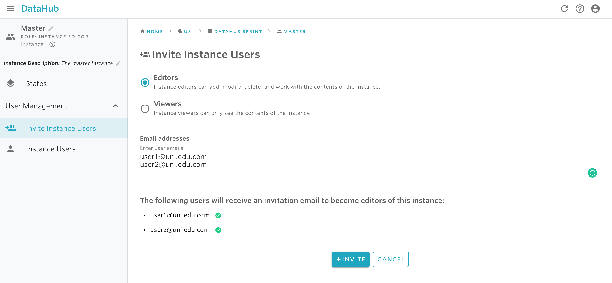

# Invite instance users

At the instance level, there are two type of permission that can be granted: instance editor and viewer. For details on the types of rights each of these roles has, please read [here](../data-organization/instances.md).

Before granting access rights to an instance, make sure that the right permissions are set. Only space administrators are allowed to grant access right for an instance.

## **To invite a new instance user:**

1. Find and select the instance you want to invite users to. For instructions on how to find an instance, check the documentation available [here](find-an-instance.md). 
2. From the sidebar on the left, click on **Invite Instance Users.** 
3. Provide the emails of the users you want to invite to the instance. 
4. Click on invite.

#### If you are encountering a problem inviting instance users, refer to the troubleshooting guide here. 

