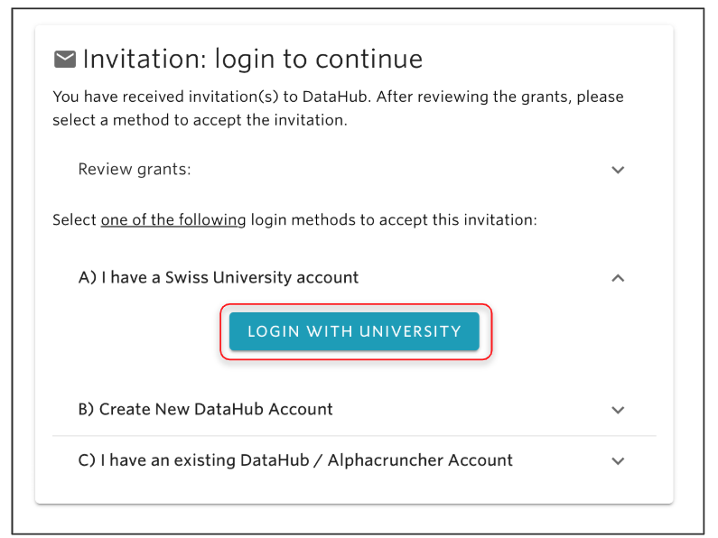
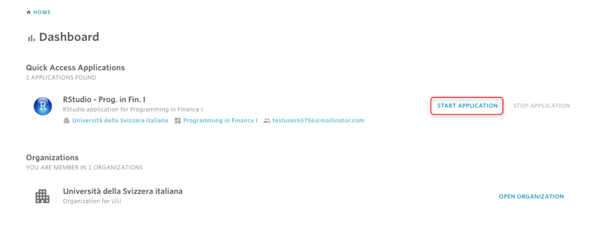
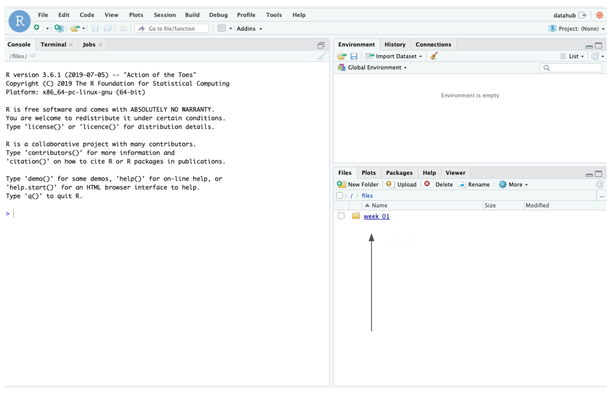
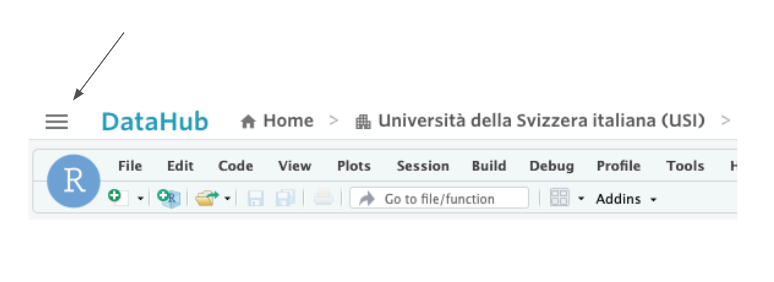
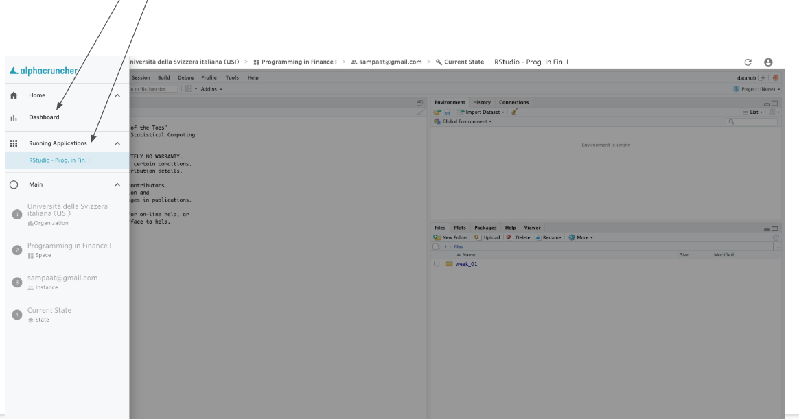

# Getting started with a class

## **To get started with a class, here are the steps to follow:**

## 1- **Accept the invitation sent to your email.**

Each student of a class must receive an invitation email to the email address which they provided to their teacher. Check your mailbox the teacher has sent the invitation to and accept the invitation. To accept the invitation, you first need to click on the **Review** **Invitation** button to start.

### **If you haven't received an invitation email, please check the troubleshooting documentation** [**here**](../troubleshooting/login-issues/i-havent-received-an-invitation-email.md)**.**

After that, you will see a number of options to accept the invitation. If you are a member of a Swiss university, for example USI, then simply select the “**I have a Swiss University account**” option. In such case, you will be able to log in with your regular USI credentials. If you log in with your Swiss account, then you will accept the invitation and you will be logged in to DataHub. 

## 2- Locate and start/open your application

Once logged in to DataHub, the first page you will is the Dashboard which displays which [organizations](../data-organization/organizations.md) you are member of, and the most recent applications that were created and used.  
  
While in the dashboard, if you want to open an application and start working with it, then first locate the application under **Quick Access Applications,** then from the right side click on **START APPLICATION.** This will start your application and will take you to the view where you can start working with the application. If you have already started the application, then instead of **START APPLICATION**, the button will be called **OPEN APPLICATION**. In the screenshot below, the user has one RStudio application. **** 

### **Make sure that you do not simultaneously open the same application in separate tabs in your browser.**

## ​3- Open and work with files from the application.

When you open an application, you will have already your files and folder ready to be used. For example, suppose you are working with an RStudio application and you have an R code inside a folder called **week\_01**.  Inside the application, you will see your folder under the **FILES** tab on the right. If you click on the folder, then you will be able to see the contents of it which will include the R code you are looking for. Clicking on the R file, you will be able to see and work with it in the R console.

## 4- How to work with another application?

If you are currently working with an application, and you want to switch to another application, then first, from the top toolbar click on the three-lines icon in the top-left.

### With the toolbar icon in the top-left, you can get to your applications from anywhere in DataHub.

And then you can either navigate to the dashboard where you can open another application from the Quick Access Applications list, or from the side bar you can select one of the running applications.

