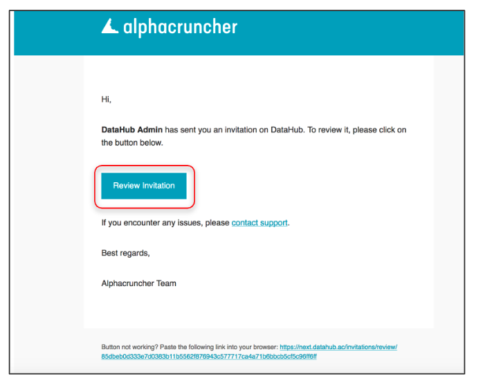

# Getting started with a class

## **To get started with a class, here are the steps to follow**

### 1- **Accept the invitation sent to your email.**

Each student of a class must receive an invitation email to their electronic mail which they provided to their teacher. Check your mailbox the teacher has sent the invitation to and accept the invitation. To accept the invitation, you first need to click on the **Review** **Invitation** button to start.

**If you haven't received an invitation email, please check the troubleshooting documentation** [**here**](../troubleshooting/login-issues/i-havent-received-an-invitation-email.md)**.**  
  
  
After that, you will see a number of options to accept the invitation. If you are a member of a Swiss university, for example USI, then simply select the “**I have a Swiss University account**” option. In such case, you will be able to log in with your regular USI credentials. If you log in with your Swiss account, then you will accept the invitation and you will be logged in to DataHub. 

### 2- Locate and start/open your application

Upon successful acceptance of the invitation, you will be logged in to DataHub.The first page you will is the Dashboard which displays which [organizations](../data-organization/organizations.md) you are member of and the most recent applications that were created and used.  
  
While in the dashboard, if you want to open an application and start working with it, then first locate the application under **Quick Access Applications,** then from the right side click on **START APPLICATION.** This will take you to the view where you can start interacting with the application. If you have already started the application, then instead of **START APPLICATION**, the button will be called **OPEN APPLICATION**.

 

